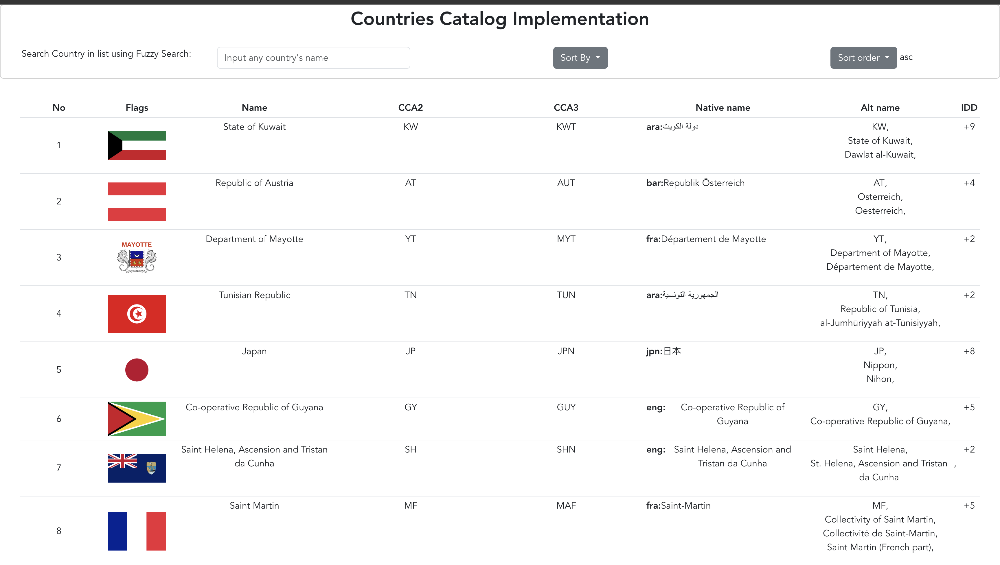

# Countries_Catalog_Page
Coding assignment with Vue.js for implementation of simple countries catalog page with fews features:
- sort by country name.
- and search by country name using fuzzy algorithm.

# Web page Interface Overview, 

Below is the image of our page which the top one show, how it looks for the catalog, plus the bottom pagination buttons.

